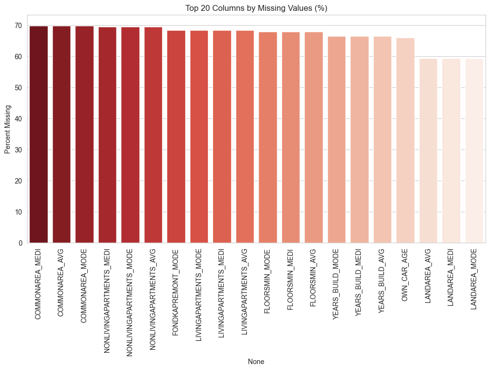
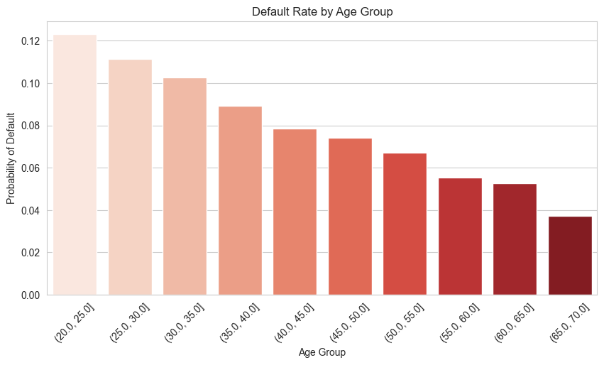
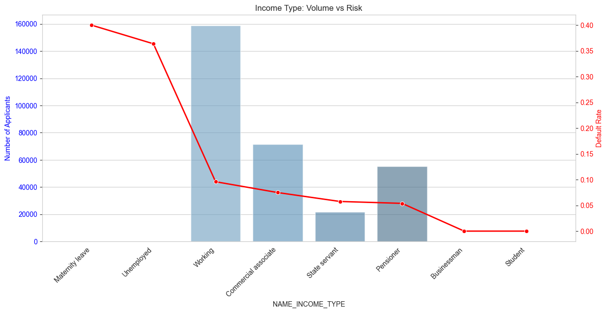
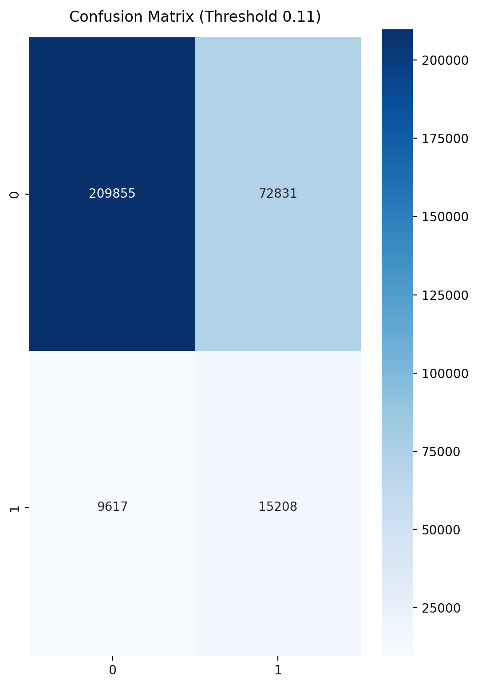
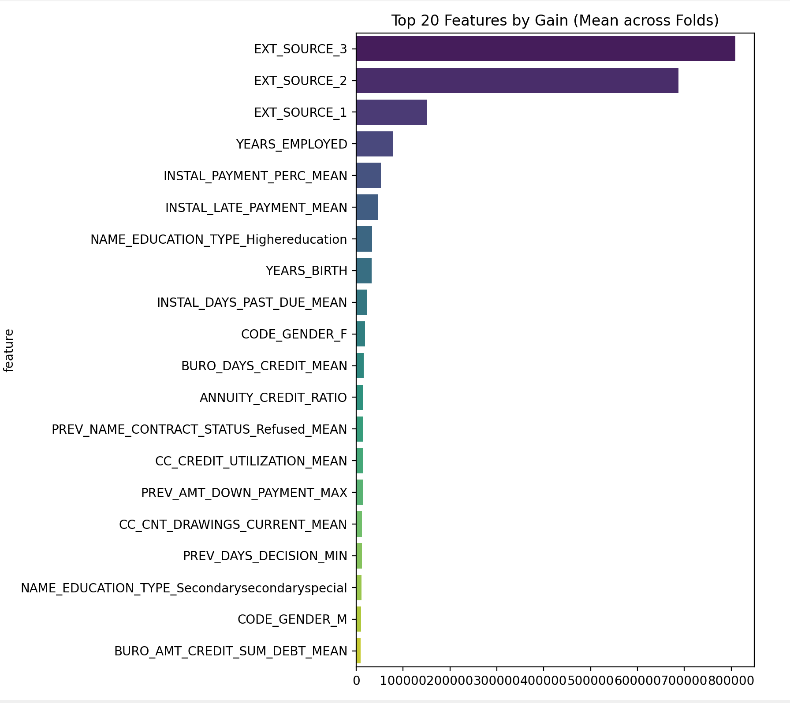

# 🏦 Bank Credit Risk Assessment System

End-to-end machine learning system to predict loan default risk using real-world banking data and support risk-aware, data-driven lending decisions.

---

## 📌 Executive Summary

Banks face a critical challenge in balancing loan approvals with default risk.  
This project builds a machine learning–based **Credit Risk Assessment System** that predicts the probability of loan default using applicant demographic, financial, and credit history data.

The solution is designed for **highly imbalanced real-world banking datasets** and emphasizes business-aware evaluation, interpretability, and responsible lending practices.

---

## 🎯 Problem Statement

Loan defaults lead to significant financial losses for banks and lending institutions.  
Traditional rule-based credit scoring systems struggle to capture complex customer behavior and scale with large datasets.

This project aims to:
- Identify high-risk applicants before loan approval  
- Reduce false approvals of potential defaulters  
- Support explainable and data-driven credit decisions  

---

## 🧠 Solution Architecture

The system follows a modular and scalable machine learning pipeline:

- Data ingestion from multiple banking data sources  
- Exploratory Data Analysis (EDA) for risk understanding  
- Feature engineering and preprocessing  
- Model training with cross-validation  
- Risk probability prediction for decision support  

---

## 📊 Dataset Overview & Risk Characteristics


- The dataset is highly imbalanced, with only **~8% default cases**  
- Reflects real-world banking risk distributions  
- Requires evaluation beyond accuracy, with emphasis on recall and risk sensitivity  

---

## 🔍 Exploratory Data Analysis (EDA)

### Missing Values Assessment


- Real-world banking data contains significant missingness  
- Guided feature selection and imputation strategies  

### Feature Correlation Analysis


- External credit score features show the strongest relationship with default risk  
- Low multicollinearity improves model stability  

---

## 💡 Business Insights & Risk Patterns

### Age-Based Risk Analysis


- Younger applicants show higher default probability  
- Risk decreases with financial maturity and stable employment  

### Income Type Risk Analysis


- Unstable income sources correlate with higher default risk  
- Income stability is more indicative than income amount  

### Education Level Insight
- Higher education levels generally correlate with lower default rates  
- Acts as a proxy for financial literacy and earning consistency  
- Insufficient alone without supporting credit history  

---

## 🤖 Machine Learning Approach

- LightGBM classifier optimized for imbalanced credit risk data  
- Stratified K-Fold Cross-Validation for stable performance  
- Business-driven threshold tuning  
- Evaluation focused on risk-sensitive metrics  

---

## 📈 Model Performance & Evaluation

### ROC Curve Analysis


- Demonstrates the model’s ability to distinguish between defaulters and non-defaulters  
- ROC-AUC is preferred over accuracy due to strong class imbalance  
- Confirms stable discrimination power across risk thresholds  

### Confusion Matrix Analysis


- Effectively distinguishes defaulters and non-defaulters  
- False negatives are minimized to reduce high-risk loan approvals  
- Thresholds are aligned with real-world banking risk tolerance  
 

---

## 🔎 Model Explainability



- Credit history and repayment behavior dominate predictions  
- Demographic features play a secondary role  
- Supports explainable and responsible lending decisions  

---

## 🛠️ Tech Stack

- **Programming Language:** Python  
- **Libraries & Tools:**  
  - Pandas  
  - NumPy  
  - Scikit-learn  
  - LightGBM  
  - Matplotlib  
  - Seaborn  
  - Joblib  

---

## 📁 Project Structure

```
├── eda.ipynb              # Exploratory Data Analysis
├── model_training.py     # Model training and evaluation pipeline
├── main.py               # End-to-end execution script
├── requirements.txt      # Project dependencies
```

---

## ▶️ How to Run the Project

1. Clone the repository
   ```bash
   git clone https://github.com/Lavinasonp/Home_credit_banking.git
   cd bank-credit-risk-system
   ```

2. Install dependencies
   ```bash
   pip install -r requirements.txt
   ```

3. Run the pipeline
   ```bash
   python main.py
   ```

---

## 🎯 Key Takeaways

- Built an end-to-end credit risk assessment system aligned with real banking use cases  
- Addressed imbalanced data using business-aware evaluation strategies  
- Translated model outputs into actionable risk insights  
- Emphasized interpretability and responsible AI practices  

---

## ⭐ Why This Project Stands Out

- Solves a real-world banking risk problem  
- Uses industry-relevant machine learning techniques  
- Balances technical performance with business impact  
- Follows professional ML engineering standards  
